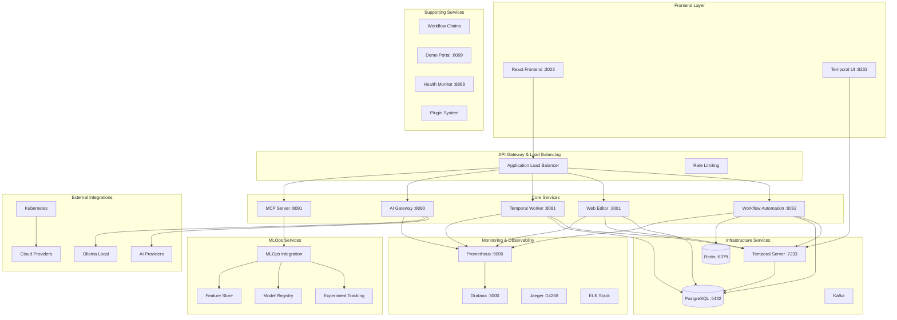
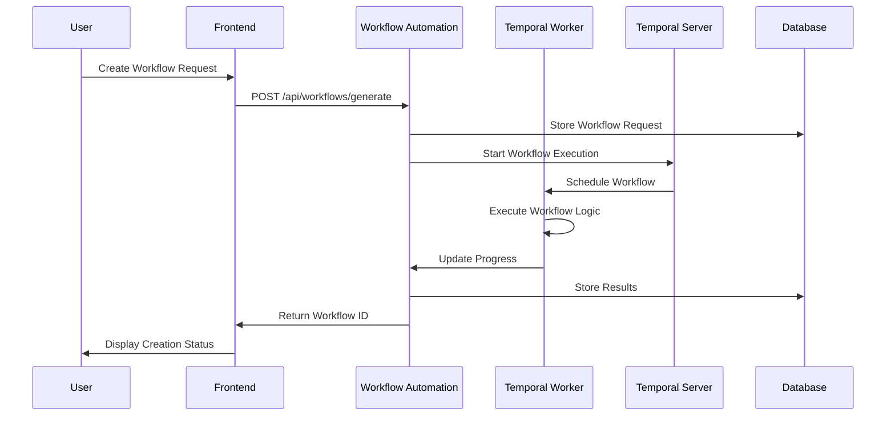
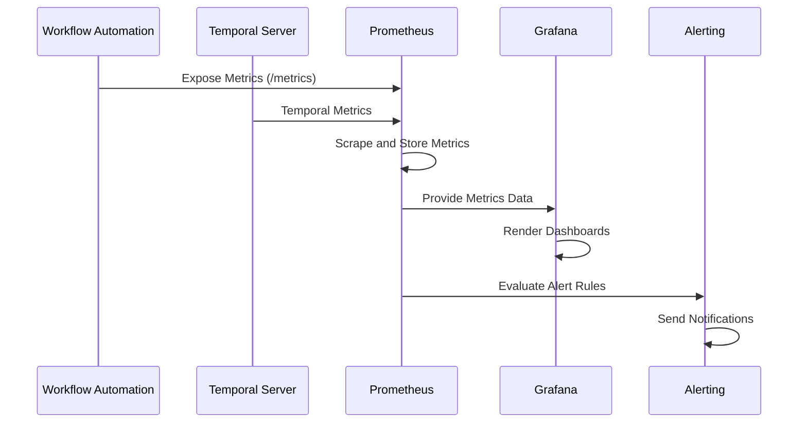

# Temporal AI Workflow Platform - Architecture Overview

## System Architecture

The Temporal AI Workflow Platform is designed as a distributed microservices architecture with 11 core services, providing comprehensive workflow orchestration, MLOps integration, and enterprise-grade features.

## High-Level Architecture Diagram



## Service Details

### Frontend Layer

#### React Frontend (Port 3003)
- **Technology**: React 18, TypeScript, Vite
- **Features**: Drag-and-drop workflow editor, real-time updates, responsive UI
- **Architecture**: Single Page Application (SPA) with client-side routing
- **State Management**: Zustand for application state
- **Communication**: REST APIs, WebSocket for real-time features
- **Deployment**: Nginx static file serving with API proxying

#### Temporal Web UI (Port 8233)
- **Technology**: Temporal's official web interface
- **Features**: Workflow monitoring, execution history, debugging
- **Integration**: Direct connection to Temporal Server
- **Authentication**: Integrated with platform authentication

### Core Services

#### Workflow Automation Service (Port 8092)
**Role**: Primary workflow generation and management API

**Technology Stack**:
- Node.js, TypeScript, Fastify
- Bull queues for background processing
- PostgreSQL for persistence
- Redis for caching and session management

**Key Responsibilities**:
- Workflow code generation and validation
- Iterative quality improvement system (25 iterations max)
- Template management and schema generation
- Temporal workflow orchestration coordination
- MLOps pipeline integration

**API Endpoints**:
```
POST /api/workflows/generate          - Simple workflow generation
POST /api/workflows/generate-iterative - Complex iterative generation
GET  /api/executions/:id              - Execution status tracking
GET  /api/workflows/templates         - Template management
GET  /api/meta/discovery              - API discovery
```

#### Web Editor Service (Port 3001)
**Role**: Visual workflow editor backend and collaboration

**Technology Stack**:
- Node.js, TypeScript, Fastify
- PostgreSQL for workflow and template storage
- WebSocket for real-time collaboration

**Key Responsibilities**:
- Visual workflow editor API
- Template and schema management
- Search and filtering functionality
- Real-time collaboration features
- Workflow validation and linting

**API Endpoints**:
```
GET/POST /web-editor/workflows        - Workflow CRUD operations
GET/POST /web-editor/templates        - Template management
POST     /web-editor/validate         - Workflow validation
GET      /web-editor/search           - Search functionality
GET      /api/meta/discovery          - API discovery
```

#### Temporal Worker Service (Port 8081)
**Role**: Temporal workflow and activity execution engine

**Technology Stack**:
- Node.js, TypeScript
- Temporal TypeScript SDK
- PostgreSQL for execution tracking
- Webpack for workflow bundling

**Key Responsibilities**:
- Workflow and activity execution
- Error handling and retry logic
- Resource management and concurrency control
- Performance monitoring and optimization
- Integration with external services

**Configuration**:
```yaml
Max Concurrent Activities: 20
Max Concurrent Workflows: 10
Task Queue: workflow-automation
Temporal Address: temporal-server:7233
```

#### AI Gateway Service (Port 8090)
**Role**: AI provider abstraction and intelligent routing

**Technology Stack**:
- Node.js, TypeScript
- Circuit breaker patterns
- Rate limiting and cost optimization
- Multi-provider failover

**Key Responsibilities**:
- AI provider abstraction (OpenAI, Anthropic, Azure, AWS, Google)
- Local AI integration (Ollama)
- Rate limiting and cost management
- Response caching and optimization
- Provider health monitoring and failover

**Supported Providers**:
- OpenAI (GPT-4, GPT-3.5-turbo)
- Anthropic (Claude)
- Azure OpenAI
- AWS Bedrock
- Google Vertex AI
- Local Ollama models

#### MCP Server Service (Port 8091)
**Role**: Model Control Plane and workflow tracking

**Technology Stack**:
- Python, FastAPI
- Model registry integration
- Workflow execution tracking

**Key Responsibilities**:
- Model lifecycle management
- Workflow execution monitoring
- Performance metrics collection
- Integration with MLOps tools
- Compliance and governance tracking

### Supporting Services

#### Workflow Chains Service
**Role**: Complex multi-workflow orchestration

**Features**:
- Chain multiple workflows together
- Conditional workflow execution
- Parallel workflow execution
- Inter-workflow data passing
- Error handling and recovery

#### Demo Portal Service (Port 8099)
**Role**: Platform demonstration and onboarding

**Features**:
- Interactive demos and tutorials
- Sample workflow templates
- User onboarding flows
- Feature showcases
- Integration examples

#### Health Monitor Service (Port 8888)
**Role**: System health and performance monitoring

**Technology Stack**:
- Node.js, Express
- Prometheus metrics
- Custom health check logic

**Monitoring Capabilities**:
- Service health checks
- Database connection monitoring
- Memory and CPU usage tracking
- API response time monitoring
- Custom business metrics

#### Plugin System
**Role**: Platform extensibility and custom functions

**Features**:
- Custom workflow activities
- Third-party integrations
- Security validation and sandboxing
- Plugin registry and marketplace
- Runtime plugin loading

### MLOps Services

#### MLOps Integration
**Role**: Machine learning operations and lifecycle management

**Technology Stack**:
- MLflow for experiment tracking
- Kubeflow Pipelines for ML workflows
- Model registry and versioning
- Feature store integration

**Key Features**:
- Experiment tracking and comparison
- Model versioning and deployment
- Automated ML pipeline orchestration
- Model performance monitoring
- A/B testing and rollout management

#### Experiment Tracking
**Integration**: MLflow backend with PostgreSQL storage
- Experiment metadata and artifacts
- Model metrics and parameters
- Comparison and visualization tools
- Integration with workflow execution

#### Model Registry
**Features**:
- Model versioning and lineage
- Deployment status tracking
- Model approval workflows
- Performance benchmarking
- Rollback capabilities

#### Feature Store (Feast)
**Features**:
- Feature definition and management
- Online and offline feature serving
- Feature versioning and lineage
- Data quality monitoring
- Integration with ML pipelines

### Infrastructure Services

#### Temporal Server (Port 7233)
**Role**: Workflow orchestration engine

**Technology**: Temporal.io v1.28.1
**Database**: PostgreSQL for persistence
**Features**:
- Durable workflow execution
- Automatic retries and error handling
- Workflow versioning and migration
- Visibility and debugging tools
- Scalable worker management

#### PostgreSQL Database (Port 5432)
**Role**: Primary data persistence layer

**Configuration**:
- Multi-database setup for service isolation
- Connection pooling for performance
- Read replicas for scaling
- Automated backup and recovery

**Databases**:
- `temporal` - Temporal server data
- `temporal_ai_platform` - Application data
- `temporal_development` - Development/testing

#### Redis Cache (Port 6379)
**Role**: Caching and session management

**Features**:
- Session storage and management
- Bull queue backend for job processing
- Response caching for performance
- Rate limiting data storage
- Pub/sub for real-time features

#### Kafka (Optional)
**Role**: Event streaming and messaging

**Use Cases**:
- Workflow event streaming
- MLOps pipeline events
- Real-time notifications
- Service-to-service messaging
- Audit log streaming

### Monitoring & Observability

#### Prometheus (Port 9090)
**Role**: Metrics collection and storage

**Metrics Collection**:
- Service health and performance metrics
- Custom business metrics
- Infrastructure metrics
- Application-specific metrics

#### Grafana (Port 3000)
**Role**: Metrics visualization and dashboards

**Dashboards**:
- System overview and health
- Service-specific metrics
- Business KPI tracking
- Infrastructure monitoring
- Custom operational dashboards

#### Jaeger (Port 14268)
**Role**: Distributed tracing

**Features**:
- Request tracing across services
- Performance bottleneck identification
- Service dependency mapping
- Error tracking and debugging

#### ELK Stack
**Role**: Centralized logging and analysis

**Components**:
- Elasticsearch for log storage
- Logstash for log processing
- Kibana for log visualization
- Structured logging across all services

### External Integrations

#### AI Providers
- **OpenAI**: GPT-4, GPT-3.5-turbo models
- **Anthropic**: Claude models
- **Azure OpenAI**: Enterprise AI services
- **AWS Bedrock**: Managed AI services
- **Google Vertex AI**: Google Cloud AI
- **Local Ollama**: On-premises AI models

#### Kubernetes Integration
- **Deployment**: Helm charts for production deployment
- **Scaling**: Horizontal pod autoscaling
- **Service Discovery**: Kubernetes native service discovery
- **Load Balancing**: Kubernetes ingress and load balancing

#### Cloud Provider Integration
- **AWS**: EKS, RDS, ElastiCache, S3, CloudWatch
- **Azure**: AKS, Azure Database, Azure Cache, Blob Storage
- **Google Cloud**: GKE, Cloud SQL, Memorystore, Cloud Storage

## Data Flow Architecture

### Workflow Creation Flow


### Real-time Monitoring Flow


## Security Architecture

### Authentication & Authorization
- **JWT-based Authentication**: Service-to-service communication
- **API Key Management**: External API access control
- **Role-Based Access Control**: User permission management
- **OAuth2 Integration**: Third-party authentication providers

### Network Security
- **Service Mesh**: Istio for service-to-service encryption
- **TLS Termination**: HTTPS/TLS for all external communications
- **Network Policies**: Kubernetes network segmentation
- **Firewall Rules**: Infrastructure-level access control

### Data Security
- **Encryption at Rest**: Database and file storage encryption
- **Encryption in Transit**: All service communications
- **Secret Management**: Kubernetes secrets and external vaults
- **Data Classification**: Sensitive data identification and handling

### API Security
- **Rate Limiting**: Per-service and per-endpoint limits
- **Input Validation**: Comprehensive request validation
- **Output Sanitization**: Response data sanitization
- **CORS Configuration**: Cross-origin request security

## Scalability Architecture

### Horizontal Scaling
- **Service Replication**: Auto-scaling based on metrics
- **Load Balancing**: Intelligent request distribution
- **Database Scaling**: Read replicas and sharding
- **Cache Scaling**: Redis clustering and replication

### Performance Optimization
- **Connection Pooling**: Database and service connections
- **Response Caching**: Multi-level caching strategy
- **CDN Integration**: Static asset delivery optimization
- **Async Processing**: Background job processing

### Resource Management
- **Resource Quotas**: Per-service resource limits
- **Quality of Service**: Priority-based resource allocation
- **Auto-scaling**: Metric-based scaling policies
- **Cost Optimization**: Efficient resource utilization

## Disaster Recovery & Business Continuity

### Backup Strategy
- **Database Backups**: Automated daily backups with point-in-time recovery
- **Configuration Backups**: Infrastructure as code and configuration management
- **Application State**: Workflow state persistence and recovery
- **Cross-region Replication**: Multi-region deployment capabilities

### High Availability
- **Service Redundancy**: Multiple instance deployment
- **Database Clustering**: PostgreSQL high availability setup
- **Load Balancer Failover**: Automatic traffic routing
- **Health Check Integration**: Proactive failure detection

### Monitoring & Alerting
- **Proactive Monitoring**: Comprehensive health checks
- **Intelligent Alerting**: Context-aware alert routing
- **Incident Response**: Automated incident detection and response
- **Root Cause Analysis**: Distributed tracing and log correlation

This architecture provides a robust, scalable, and secure foundation for enterprise-grade workflow orchestration with comprehensive MLOps integration and real-time monitoring capabilities.