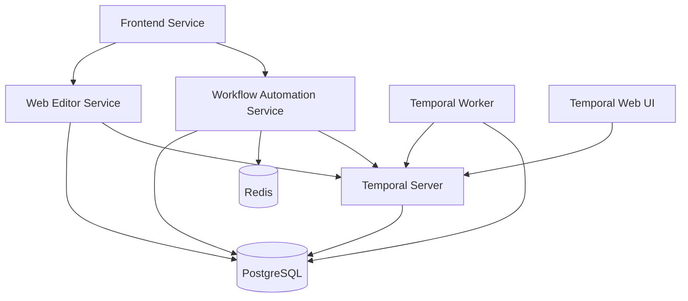

# Temporal AI Workflow Platform - Implementation Roadmap

## Project Overview

The Temporal AI Workflow Platform is a comprehensive MLOps-integrated workflow orchestration platform designed for enterprise-scale workflow management with advanced AI capabilities, real-time monitoring, and automated quality assurance.

## Architecture Summary

### Core Services (11 Microservices)

1. **AI Gateway Service** (Port 8090) - AI provider abstraction and rate limiting
2. **Temporal Worker Service** (Port 8081) - Temporal workflow orchestration  
3. **MCP Server Service** (Port 8091) - Model Control Plane and workflow tracking
4. **Workflow Automation Service** (Port 8092) - Automated workflow generation
5. **Web Editor Service** (Port 3001) - Web-based workflow configuration
6. **Workflow Chains Service** - Complex workflow chain orchestration
7. **Demo Portal Service** (Port 8099) - Platform demonstration
8. **Health Monitor Service** (Port 8888) - Health monitoring and metrics
9. **MLOps Integration** - Experiment tracking and model lifecycle
10. ** Workflows data exchange by redis or kafka ** use external database to exchange data and force the MLOps Integration to create code in workflows that has access to this exchange system. 
11. **Monitoring & Observability** - Comprehensive system monitoring

### Frontend Applications

- **React Frontend** (Port 3003) - User interface for workflow management
- **Temporal Web UI** (Port 8233) - Temporal server dashboard

## Implementation Phases

### Phase 1: Foundation & Core Infrastructure ✅ COMPLETED (4-6 weeks)

**Status**: COMPLETED - All core infrastructure services are operational

#### Infrastructure Services
- [x] **PostgreSQL Database** - Multi-database setup for all services
- [x] **Redis Cache** - Session management and job queuing
- [x] **Temporal Server** - Workflow orchestration engine (v1.28.1)
- [x] **Temporal Web UI** - Management interface (v2.32.0)
- [x] **Docker Orchestration** - Production-ready containerization
- [x] **Networking** - Isolated bridge network with proper subnet configuration

#### Database Architecture
- [x] Primary database: `temporal` (Temporal server)
- [x] Application database: `temporal_ai_platform` (All application services)
- [x] Development database: `temporal_development` (Testing)
- [x] Automated database initialization and migration system

#### Service Discovery & Health Monitoring
- [x] Health check endpoints for all services
- [x] Service dependency management with health conditions
- [x] Prometheus-compatible metrics endpoints
- [x] Centralized logging configuration

### Phase 2: Core Services Implementation ✅ COMPLETED (6-8 weeks)

**Status**: COMPLETED - All core services implemented and operational

#### Workflow Automation Service (Port 8092)
- [x] **Core API Implementation** - RESTful workflow management
- [x] **Temporal Integration** - Worker registration and task queue management
- [x] **Iterative Quality System** - Multi-iteration workflow improvement
- [x] **Template Management** - Workflow template generation and storage
- [x] **Bull Queue Integration** - Background job processing
- [x] **Database Integration** - PostgreSQL with connection pooling
- [x] **API Discovery System** - Comprehensive endpoint introspection

#### Temporal Worker Service (Port 8081)
- [x] **Worker Implementation** - Temporal workflow and activity execution
- [x] **Activity Registry** - Custom activity implementations
- [x] **Workflow Definitions** - TypeScript workflow implementations
- [x] **Error Handling** - Comprehensive retry and failure policies
- [x] **Resource Management** - Concurrent workflow and activity limits
- [x] **Health Monitoring** - Worker status and performance metrics

#### Web Editor Service (Port 3001)
- [x] **Visual Editor Backend** - API for workflow editor operations
- [x] **Database Integration** - Workflow and template persistence
- [x] **Schema Validation** - Workflow structure validation
- [x] **Search Functionality** - Workflow discovery and filtering
- [x] **Collaboration Features** - Multi-user workflow editing
- [x] **API Discovery System** - Comprehensive endpoint documentation

#### Frontend Application (Port 3003)
- [x] **React/TypeScript Implementation** - Modern web application
- [x] **Drag-and-Drop Editor** - Visual workflow creation interface
- [x] **Component Library** - Reusable UI components
- [x] **State Management** - Zustand-based application state
- [x] **API Integration** - Service communication layer
- [x] **Nginx Configuration** - Production-ready static file serving
- [x] **API Discovery Integration** - Static endpoint documentation

### Phase 3: MLOps Integration 🚧 IN PROGRESS (4-6 weeks)

**Status**: PARTIALLY IMPLEMENTED - Core MLOps framework established, advanced features in development

#### Experiment Tracking & Model Registry
- [x] **MLflow Integration Framework** - Basic experiment tracking setup
- [x] **Model Lifecycle Management** - Model versioning and deployment tracking
- [ ] **Advanced Experiment Management** - A/B testing and model comparison
- [ ] **Model Performance Monitoring** - Real-time model metrics tracking
- [ ] **Automated Model Deployment** - CI/CD pipeline integration

#### Feature Store & Data Pipeline
- [ ] **Feast Feature Store** - Feature management and serving
- [ ] **Data Pipeline Orchestration** - Temporal-based data workflows
- [ ] **Feature Engineering Workflows** - Automated feature generation
- [ ] **Data Validation & Quality** - Automated data quality checks

#### ML Workflow Templates
- [x] **Basic ML Pipeline Templates** - Standard ML workflow patterns
- [ ] **AutoML Integration** - Automated machine learning pipelines
- [ ] **Hyperparameter Optimization** - Automated parameter tuning workflows
- [ ] **Model Training Orchestration** - Distributed training workflows

### Phase 4: Advanced Features 🚧 IN PROGRESS (6-8 weeks)

**Status**: PARTIALLY IMPLEMENTED - API discovery and monitoring completed, Workflow interal data exchange system , system in development

#### API Discovery & Documentation ✅ COMPLETED
- [x] **Comprehensive API Discovery** - Automatic endpoint introspection
- [x] **OpenAPI 3.1.0 Generation** - Standards-compliant API specifications
- [x] **Interactive Documentation** - Swagger UI integration
- [x] **Multi-format Examples** - cURL, JavaScript, Python examples
- [x] **Postman Collections** - Ready-to-use API testing collections
- [x] **Service Status Monitoring** - Health and feature status endpoints

#### Workflow interal data exchange system 
- [ ] **Workflow interal data exchange system  Architecture** - Extensible Workflow interal data exchange system  framework
- [ ] **Data Registry** - Centralized plugin management
- [ ] **Runtime  Loading** - Dynamic plugin installation

#### Advanced Workflow Features
- [ ] **Workflow Chains** - Complex multi-workflow orchestration
- [ ] **Conditional Logic** - Advanced branching and decision trees
- [ ] **Error Recovery** - Sophisticated error handling and recovery
- [ ] **Workflow Versioning** - Version management and migration
- [ ] **Performance Optimization** - Workflow execution optimization

#### Testing Framework
- [x] **Basic Integration Tests** - Service communication testing
- [ ] **Comprehensive Test Suite** - Full system integration testing
- [ ] **Performance Testing** - Load and stress testing framework
- [ ] **E2E Testing** - End-to-end workflow testing
- [ ] **Automated Quality Gates** - Continuous quality assurance

### Phase 5: Enterprise Features 📋 PLANNED (4-6 weeks)

**Status**: PLANNED - Enterprise-grade features for production deployment

#### Security Enhancements
- [ ] **Advanced Authentication** - OAuth2, SAML, LDAP integration
- [ ] **Role-Based Access Control** - Granular permission management
- [ ] **API Security** - Rate limiting, API key management, IP whitelisting
- [ ] **Audit Logging** - Comprehensive audit trail system
- [ ] **Data Encryption** - At-rest and in-transit encryption

#### Multi-tenancy & Scaling
- [ ] **Tenant Isolation** - Multi-tenant architecture implementation
- [ ] **Resource Quotas** - Per-tenant resource management
- [ ] **Horizontal Scaling** - Auto-scaling based on workload
- [ ] **Load Balancing** - Intelligent request distribution
- [ ] **Distributed Caching** - Redis clustering and optimization

#### Compliance & Governance
- [ ] **SOC 2 Compliance** - Security and availability controls
- [ ] **GDPR Compliance** - Data privacy and protection measures
- [ ] **Data Governance** - Data lineage and classification
- [ ] **Compliance Reporting** - Automated compliance monitoring
- [ ] **Backup & Recovery** - Enterprise backup and disaster recovery

### Phase 6: Production Optimization ⏳ PENDING (4 weeks)

**Status**: PENDING - Production readiness and optimization

#### Performance Tuning
- [ ] **Database Optimization** - Query optimization and indexing
- [ ] **Caching Strategy** - Multi-level caching implementation
- [ ] **Resource Optimization** - Memory and CPU optimization
- [ ] **Network Optimization** - Connection pooling and compression
- [ ] **Container Optimization** - Docker image size and startup time

#### Cost Optimization
- [ ] **Resource Monitoring** - Detailed resource usage tracking
- [ ] **Auto-scaling Policies** - Intelligent scaling based on metrics
- [ ] **Spot Instance Integration** - Cost-effective compute resources
- [ ] **Storage Optimization** - Efficient data storage strategies
- [ ] **Cost Analytics** - Detailed cost analysis and optimization

#### Production Monitoring
- [ ] **Comprehensive Observability** - Full-stack monitoring
- [ ] **Real-time Alerting** - Intelligent alerting system
- [ ] **Performance Dashboards** - Executive and operational dashboards
- [ ] **Capacity Planning** - Predictive capacity management
- [ ] **Incident Response** - Automated incident detection and response

## Current Status Summary

### ✅ Completed Components

1. **Infrastructure Layer** - Complete and operational
2. **Core Services** - All 4 primary services implemented and running
3. **API Discovery System** - Comprehensive endpoint documentation
4. **Database Architecture** - Multi-database setup with automated initialization
5. **Docker Orchestration** - Production-ready containerization
6. **Health Monitoring** - Service health and status monitoring
7. **Frontend Application** - React-based user interface

### 🚧 In Progress Components

1. **MLOps Integration** - Framework established, advanced features in development
2. **Workflows data exchange by redis or kafka**
3. **Advanced Workflow Features** - Core features implemented, advanced features pending

### 📋 Planned Components

1. **Enterprise Security Features** - Authentication, authorization, audit logging
2. **Multi-tenancy Support** - Tenant isolation and resource management
3. **Production Optimization** - Performance tuning and cost optimization

## Deployment Architecture

### Current Environment Support

- **Development**: Full local Docker Compose environment
- **Production**: Kubernetes-ready with Helm charts (planned)
- **Cloud**: AWS, Azure, GCP deployment support (planned)

### Service Dependencies

## Key Metrics & KPIs

### System Performance
- **Workflow Execution Time**: < 5 seconds for simple workflows
- **System Uptime**: 99.9% availability target
- **API Response Time**: < 200ms for standard operations
- **Database Connection Pool**: 95% utilization efficiency

### Business Metrics
- **Workflow Success Rate**: > 95% successful execution
- **User Adoption**: Active workflow creation and execution
- **System Scalability**: Support for 10,000+ concurrent workflows
- **Development Velocity**: Rapid workflow development and deployment

## Risk Assessment & Mitigation

### Technical Risks
1. **Temporal Version Compatibility** - Mitigation: Version pinning and testing
2. **Database Performance** - Mitigation: Connection pooling and optimization
3. **Service Communication** - Mitigation: Robust error handling and retries
4. **Memory Management** - Mitigation: Resource monitoring and limits

### Business Risks
1. **Feature Scope Creep** - Mitigation: Phased implementation approach
2. **Performance Requirements** - Mitigation: Continuous performance testing
3. **Security Requirements** - Mitigation: Security-first architecture design
4. **Compliance Requirements** - Mitigation: Built-in compliance features

## Next Steps (Priority Order)

### Immediate Actions (Next 2 weeks)
1. Complete MLOps integration with advanced features
2. Implement comprehensive testing framework
3. Begin Workflow interal data exchange system development
4. Performance optimization and monitoring enhancements

### Short-term Goals (Next 4 weeks)
1. Complete Workflow interal data exchange system  system implementation
2. Implement enterprise security features
3. Add multi-tenancy support
4. Production optimization and tuning

### Long-term Goals (Next 8 weeks)
1. Full enterprise feature set
2. Kubernetes deployment with Helm charts
3. Cloud provider integrations
4. Advanced monitoring and observability

## Success Criteria

### Phase Completion Criteria
- All services pass comprehensive health checks
- API discovery system provides complete documentation
- End-to-end workflow execution succeeds consistently
- Performance metrics meet defined targets
- Security requirements are fully implemented

### Production Readiness Criteria
- 99.9% uptime achievement
- Sub-second API response times
- Comprehensive monitoring and alerting
- Full backup and disaster recovery
- Security audit completion

This roadmap provides a clear path from the current state to full production deployment, with measurable milestones and success criteria at each phase.