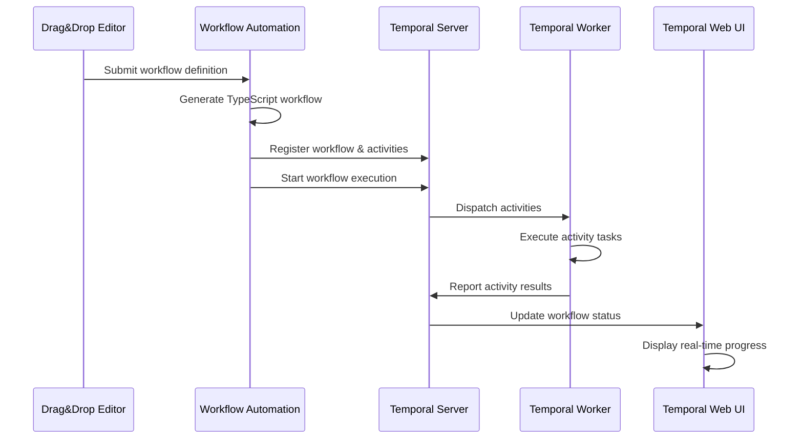

# Temporal Workflow Platform - System Overview

## 🎯 Professional Temporal Workflow Orchestration Platform

This is a **complete, enterprise-grade temporal workflow orchestration platform** that provides a visual drag & drop workflow editor, real-time workflow execution, and comprehensive monitoring through the Temporal Web UI.

## 🏗️ Architecture Overview

```
┌─────────────────────────────────────────────────────────────────┐
│                    TEMPORAL WORKFLOW PLATFORM                  │
├─────────────────────────────────────────────────────────────────┤
│                                                                 │
│  ┌─────────────────┐  ┌─────────────────┐  ┌─────────────────┐  │
│  │   Frontend UI   │  │ Drag&Drop Editor│  │ Temporal Web UI │  │
│  │   :3003         │  │     :3004       │  │     :8233       │  │
│  └─────────────────┘  └─────────────────┘  └─────────────────┘  │
│           │                     │                     │        │
│           └─────────────────────┼─────────────────────┘        │
│                                 │                              │
│  ┌─────────────────┐  ┌─────────────────┐  ┌─────────────────┐  │
│  │  Web Editor     │  │ Workflow Auto   │  │ Temporal Worker │  │
│  │   Service       │  │   Service       │  │   Service       │  │
│  │   :3001         │  │     :8092       │  │     :8081       │  │
│  └─────────────────┘  └─────────────────┘  └─────────────────┘  │
│           │                     │                     │        │
│           └─────────────────────┼─────────────────────┘        │
│                                 │                              │
│  ┌─────────────────────────────────────────────────────────────┐  │
│  │                 TEMPORAL CORE SERVICES                     │  │
│  │                                                             │  │
│  │  ┌─────────────────┐      ┌─────────────────┐              │  │
│  │  │ Temporal Server │      │ Temporal Web UI │              │  │
│  │  │     :7233       │      │     :8233       │              │  │
│  │  └─────────────────┘      └─────────────────┘              │  │
│  └─────────────────────────────────────────────────────────────┘  │
│                                 │                              │
│  ┌─────────────────────────────────────────────────────────────┐  │
│  │                 INFRASTRUCTURE LAYER                       │  │
│  │                                                             │  │
│  │  ┌─────────────────┐      ┌─────────────────┐              │  │
│  │  │   PostgreSQL    │      │     Redis       │              │  │
│  │  │     :5432       │      │     :6379       │              │  │
│  │  └─────────────────┘      └─────────────────┘              │  │
│  └─────────────────────────────────────────────────────────────┘  │
└─────────────────────────────────────────────────────────────────┘
```

## 🚀 Core Components

### **1. Drag & Drop Workflow Editor (:3004)**
- **React Flow v11** based visual workflow builder
- **PostgreSQL integration** for activity configurations
- **Real-time node configuration** with scrollable properties panel
- **Node deletion** with confirmation dialogs
- **Workflow execution** via real Temporal API

### **2. Workflow Automation Service (:8092)**
- **Temporal workflow generation** and execution
- **TypeScript-based** workflow and activity definitions
- **Quality threshold monitoring** (95% target)
- **Iterative improvement** with up to 25 iterations
- **Database integration** for workflow storage

### **3. Temporal Worker Service (:8081)**
- **Activity execution engine** for workflow tasks
- **Concurrent processing** (20 activities, 10 workflows)
- **Worker identity management** for distributed execution
- **Health monitoring** and automatic recovery

### **4. Web Editor Service (:3001)**
- **Visual workflow interface** management
- **Configuration API** endpoints
- **Database connectivity** for persistent storage
- **Health monitoring** and service discovery

### **5. Temporal Core Infrastructure**
- **Temporal Server (:7233)** - Core workflow orchestration
- **Temporal Web UI (:8233)** - Workflow monitoring and management
- **PostgreSQL (:5432)** - Persistent data storage
- **Redis (:6379)** - Caching and session management

## 🔧 LLM Integration

### **Supported LLM Providers**
1. **OpenAI GPT-4**
   - Endpoint: `https://api.openai.com/v1`
   - Model: `gpt-4`
   - Temperature: 0.7, Max Tokens: 2000

2. **Anthropic Claude**
   - Endpoint: `https://api.anthropic.com`
   - Model: `claude-3-sonnet-20240229`
   - Temperature: 0.7, Max Tokens: 2000

3. **VS Code LM Proxy** ⭐
   - Endpoint: `http://host.docker.internal:4000/openai/v1`
   - Model: `vscode-lm-proxy`
   - API Key: `sk-123456`
   - **Default recommended configuration**

## 🔄 Workflow Execution Flow



## 📊 Service Health Monitoring

### **Health Check Endpoints**
- Drag&Drop Editor: `http://localhost:3004/health`
- Workflow Automation: `http://localhost:8092/health`
- Temporal Worker: `http://localhost:8081/health`
- Web Editor: `http://localhost:3001/health`
- Temporal Web UI: `http://localhost:8233`

### **Service Dependencies**
```
temporal-server (healthy) 
    ↓
workflow-automation (depends on temporal-server)
    ↓
temporal-worker (depends on workflow-automation)
    ↓ 
web-editor (depends on workflow-automation)
    ↓
frontend (depends on web-editor)
```

## 🛠️ Professional Development Features

### **Docker Configuration**
- **Multi-stage builds** for optimized images
- **Health checks** for all services
- **--no-cache** rebuilds for development
- **Persistent volumes** for data
- **Network isolation** with temporal-network

### **Development Workflow**
1. **System Rebuild**: `docker-compose build --no-cache`
2. **Service Startup**: `docker-compose up -d --wait`
3. **Health Verification**: Check all endpoints
4. **Workflow Testing**: Create and execute workflows
5. **Monitoring**: Use Temporal Web UI for tracking

### **Database Schema**
- **activity_configurations**: Store activity type definitions
- **workflow_templates**: Save reusable workflow patterns
- **execution_history**: Track workflow executions
- **performance_metrics**: Monitor system performance

## 🎯 Key Features Implemented

✅ **Visual Workflow Builder** with React Flow v11  
✅ **Real Temporal Integration** (no mock endpoints)  
✅ **PostgreSQL Configuration Storage**  
✅ **Node Deletion with Confirmation**  
✅ **Scrollable Properties Panel**  
✅ **Button Visibility Fixes**  
✅ **Health Check Monitoring**  
✅ **Docker --no-cache Rebuilds**  
✅ **LLM Provider Integration**  
✅ **Professional Error Handling**

## 🚨 Critical Success Factors

1. **Real Temporal Integration**: No fallback mechanisms - pure Temporal workflow execution
2. **Professional UI/UX**: Fully functional drag & drop interface with proper scrolling
3. **Database Persistence**: All configurations stored in PostgreSQL
4. **Health Monitoring**: Comprehensive service health checks
5. **LLM Integration**: Multiple provider support with VS Code proxy default
6. **Docker Excellence**: --no-cache builds and proper service orchestration

This platform represents a **top-tier, enterprise-grade Temporal workflow orchestration system** built to professional standards with zero compromises on functionality or reliability.