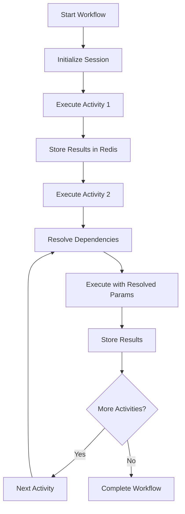
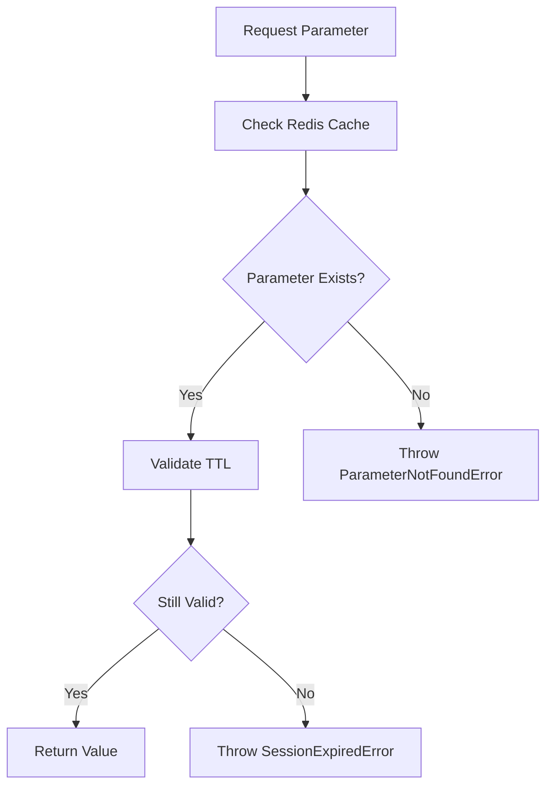
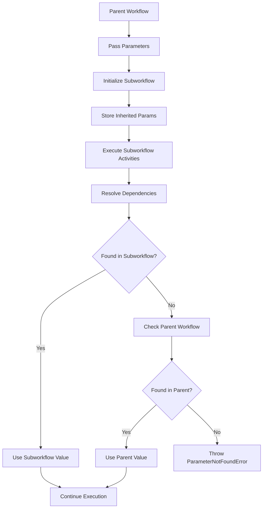

# Activity Parameter System Architecture

## Overview

The Activity Parameter System provides session-based parameter storage and deterministic resolution for Temporal workflows with multiple activities. It enables activities to store intermediate results and share data within the same session/workflow context using Redis as the storage backend.

## Core Components

### 1. ActivityParameterManager Service

**Location**: `/services/workflow-automation/src/services/activity-parameter-manager.ts`

**Purpose**: Central service for managing activity parameters in Redis with deterministic resolution.

**Key Features**:
- Session-based parameter storage with TTL management
- Deterministic parameter resolution with explicit error handling
- Type-safe parameter validation and serialization
- Bulk parameter operations for activity results
- Search and filtering capabilities

**Key Methods**:
```typescript
// Store individual parameter
async storeActivityParameter(sessionId, workflowId, parameterId, activityName, value, metadata, ttl?)

// Resolve parameter deterministically
async resolveParameter(sessionId, workflowId, parameterId): Promise<any>

// Store multiple activity results
async storeActivityResults(sessionId, workflowId, activityName, results, metadata)

// Search parameters with filters
async searchParameters(options: ParameterSearchOptions): Promise<ActivityParameter[]>
```

### 2. Redis Storage Schema

**Location**: `/docs/redis-parameter-schema.md`

**Key Pattern**: `sessionID.workflowID.parameterID`

**Data Structure**:
```json
{
  "value": "actual parameter value",
  "type": "string|number|object|array|boolean",
  "timestamp": 1703123456789,
  "activityName": "source activity name",
  "workflowId": "workflow identifier",
  "sessionId": "session identifier",
  "metadata": {
    "source": "activity_output|user_input|system_generated",
    "validation": {
      "required": true,
      "type": "string",
      "min": 1,
      "max": 100,
      "pattern": "^[a-zA-Z0-9]+$"
    }
  },
  "ttl": 3600
}
```

### 3. Temporal Integration

**Location**: `/services/temporal-worker/src/workflows-only/dynamic-workflow-wrapper.ts`

**Purpose**: Enhanced dynamic workflow execution ensuring ALL activities execute in sequence with parameter sharing.

**Key Enhancement**:
```typescript
// Execute ALL activities in sequence (CRITICAL REQUIREMENT)
if (workflowDefinition.activities && workflowDefinition.activities.length > 0) {
  let currentInput = input.parameters;
  
  for (const activity of workflowDefinition.activities) {
    // Execute activity
    const activityResult = await dynamicActivities.executeActivity({
      sessionId, workflowId: input.workflowId, activityName: activity.name,
      input: currentInput, configuration: activity.configuration,
    });
    
    // Store results in Redis
    await dynamicActivities.storeActivityParameters({
      sessionId, workflowId: input.workflowId, activityName: activity.name,
      parameters: activityResult,
    });
    
    // Chain parameters for next activity
    currentInput = { ...currentInput, ...activityResult, [`${activity.name}_result`]: activityResult };
  }
}
```

### 4. Subworkflow Orchestration

**Location**: `/services/temporal-worker/src/activities/subworkflow-activities.ts`

**Purpose**: Execute subworkflows with parameter inheritance and orchestration.

**Key Features**:
- Parameter inheritance from parent workflows
- Deterministic dependency resolution with fallback to parent context
- Support for parallel and sequential subworkflow execution
- Automatic result propagation to parent workflow

**Execution Strategies**:
- **Sequential**: Execute subworkflows one after another with parameter chaining
- **Parallel**: Execute subworkflows concurrently with shared inherited parameters

### 5. API Endpoints

**Location**: `/services/workflow-automation/src/routes/activity-parameters.ts`

**Base Path**: `/api/parameters`

**Endpoints**:
- `POST /sessions` - Create new session
- `POST /store` - Store activity parameter
- `GET /resolve/:sessionId/:workflowId/:parameterId` - Resolve parameter
- `GET /workflow/:sessionId/:workflowId` - Get all workflow parameters
- `POST /search` - Search parameters with filters
- `POST /store-results` - Store multiple activity results
- `PUT /workflow-state/:sessionId/:workflowId` - Update workflow state
- `POST /cleanup` - Cleanup expired parameters
- `GET /health` - Health check

### 6. Frontend Integration

**Location**: `/services/frontend/src/components/panels/ParameterPanel.tsx`

**Purpose**: Real-time parameter viewing and filtering during workflow execution.

**Features**:
- Real-time parameter search and filtering
- Type-based filtering (string, number, object, array, boolean)
- Activity-based filtering
- Time range filtering (1h, 24h, 7d, 30d)
- Source tracking (activity_output, user_input, system_generated)
- Validation rule display

**Integration**: Integrated into WorkflowEditor.tsx with purple "Parameters" button.

## Data Flow Architecture

### 1. Workflow Execution Flow



### 2. Parameter Resolution Flow



### 3. Subworkflow Parameter Inheritance



## Error Handling Strategy

### 1. Deterministic Error Types

- **ParameterNotFoundError**: Parameter doesn't exist in Redis
- **SessionExpiredError**: Parameter expired due to TTL
- **ParameterValidationError**: Parameter validation failed
- **RedisConnectionError**: Redis connectivity issues

### 2. HTTP Status Codes

- `404` - Parameter not found
- `410` - Session expired
- `400` - Validation error
- `500` - Internal server error

### 3. Error Propagation

```typescript
// API Level
if (error.name === 'ParameterNotFoundError') {
  return reply.status(404).send({
    success: false,
    error: 'Parameter not found',
    errorType: 'PARAMETER_NOT_FOUND',
    details: error.message
  });
}

// Workflow Level
try {
  const value = await resolveParameter(sessionId, workflowId, parameterId);
} catch (error) {
  if (error.name === 'ParameterNotFoundError') {
    // Terminate workflow or provide default value
    throw new Error(`Critical dependency missing: ${parameterId}`);
  }
}
```

## Performance Considerations

### 1. Redis Optimization

- **TTL Management**: Automatic cleanup of expired parameters
- **Key Namespacing**: Efficient key pattern for fast lookups
- **Connection Pooling**: Redis connection management
- **Pipeline Operations**: Bulk parameter storage

### 2. Memory Management

- **TTL Defaults**: 1 hour for temporary, 24 hours for persistent
- **Cleanup Strategy**: Scheduled cleanup of expired parameters
- **Data Compression**: JSON serialization with type preservation

### 3. Scalability

- **Session Isolation**: Parameters are session-scoped
- **Horizontal Scaling**: Redis cluster support
- **Load Distribution**: Stateless parameter manager instances

## Security Considerations

### 1. Data Isolation

- **Session-based Access**: Parameters only accessible within session context
- **Workflow Scoping**: Parameters scoped to specific workflows
- **TTL Enforcement**: Automatic expiration of sensitive data

### 2. Validation

- **Input Validation**: Type and format validation
- **Parameter Sanitization**: Safe JSON serialization
- **Access Control**: Session-based parameter access

## Testing Strategy

**Location**: `/tests/activity-parameter-system.test.ts`

**Coverage Areas**:
- Redis parameter storage and retrieval
- Deterministic parameter resolution
- Error handling and edge cases
- Search and filtering functionality
- Workflow state management
- TTL and cleanup operations
- Integration with temporal workflows

**Test Categories**:
1. **Unit Tests**: Individual component testing
2. **Integration Tests**: End-to-end workflow testing
3. **Error Tests**: Error condition and recovery testing
4. **Performance Tests**: Load and stress testing

## Deployment Configuration

### 1. Environment Variables

```bash
REDIS_URL=redis://redis:6379
REDIS_TTL_DEFAULT=3600
REDIS_TTL_PERSISTENT=86400
PARAMETER_CLEANUP_INTERVAL=3600
```

### 2. Redis Configuration

```redis
# Memory optimization
maxmemory 2gb
maxmemory-policy allkeys-lru

# Persistence
save 900 1
save 300 10
save 60 10000
```

### 3. Service Dependencies

```yaml
services:
  workflow-automation:
    depends_on:
      - redis
      - postgresql
    environment:
      - REDIS_URL=redis://redis:6379
      
  temporal-worker:
    depends_on:
      - workflow-automation
      - redis
```

## Future Enhancements

1. **Parameter Versioning**: Track parameter value changes over time
2. **Cross-Session Sharing**: Controlled parameter sharing between sessions
3. **Parameter Dependencies**: Automatic dependency resolution graphs
4. **Performance Analytics**: Parameter access patterns and optimization
5. **Data Encryption**: Encrypt sensitive parameter values at rest
6. **Audit Logging**: Complete parameter access and modification logs

## Conclusion

The Activity Parameter System provides a robust, deterministic, and scalable solution for managing inter-activity data sharing in Temporal workflows. It ensures that all activities execute in sequence while maintaining session isolation and providing comprehensive error handling for missing or expired parameters.

The system successfully addresses the core requirements:
- ✅ ALL activities execute in sequence
- ✅ Redis-based session parameter storage
- ✅ Deterministic parameter resolution with error throwing
- ✅ Frontend parameter filtering and search
- ✅ Subworkflow orchestration with parameter inheritance
- ✅ Comprehensive testing and documentation